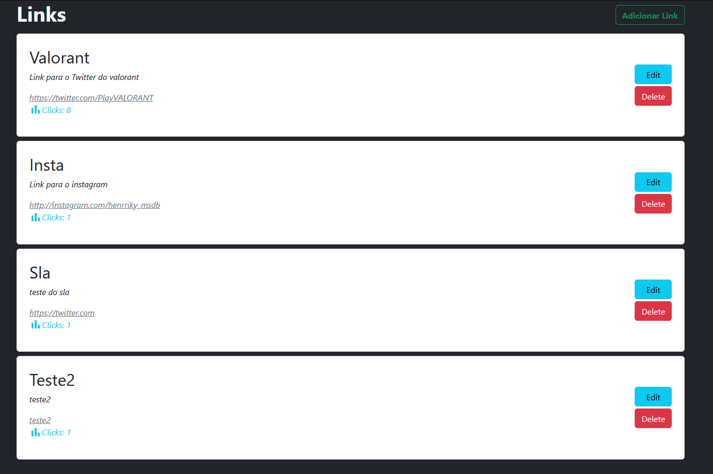

<h4 align="center"> 
	🚀 Encurtador de LINKS 🚀
</h4>

  

  

# ✅ Objetivo

- Esse site simples tem como objetivo fixar os meus conhecimentos de integração de back-end + front-end. Nesse projeto, o pricipal objetivo era desenvolver um encurtador de link utilizando Node.js mais o ORM Mongoose, que permite a conexão com o MongoDB através do node. Nesse projeto foram aplicados conceitos de arquitetura limpa e elaboração de API's com o CRUD completo, tal como a utilização da engine EJS para a exibição das páginas. Importante citar que dentro desse projeto temos a implementação de um atributo chamado `click`, que possibilita análises de quais links estão sendo mais acessados.

# 🎮 Tecnologias

- HTML
- CSS
- JavaScript
- Bootstrap
- Node.js
- EJS
- Mongoose
- MongoDB

# 🎮 Rode na sua máquina

- Para rodar o projeto na sua máquina siga os seguintes passos
  * Baixe o projeto e instale o MongoDB no site oficial. Após isso, inicie o MongoDBCompass.
  * Após iniciar o MongoDBCompass clique em Connect e vá em `Import saved connections`.
  * Selecione o arquivo que veio junto com o projeto chamado de `compass-connections.json` 
  * Abra o projeto e digite `npm install`
  * Após isso escreva o comando `node app.js`
  * Agora é só abrir o navegador e digitar [http:localhost:3000/]

# ✅ Créditos

- Créditos ao **[Programador BR](https://www.youtube.com/channel/UCrdgeUeCll2QKmqmihIgKBQ)**
